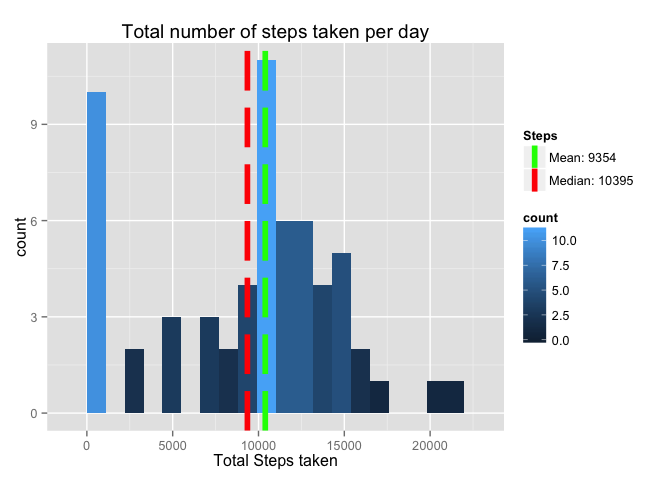
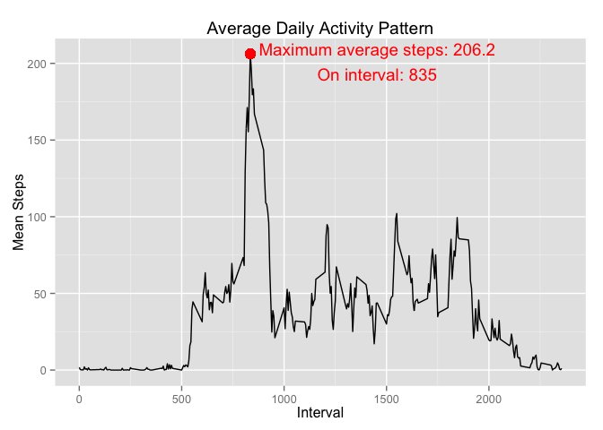
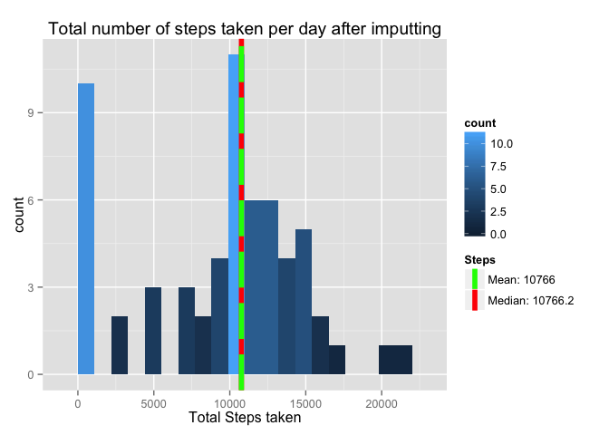

# Reproducible Research: Peer Assessment 1


## Loading and preprocessing the data

First I will clean any remaining variable in the environment:

```r
rm(list = ls(all.names = TRUE))
```
Then if the **activity.csv** file is not present in the current directory, one has to download it from [Activity Dataset for Assignment 1](https://d396qusza40orc.cloudfront.net/repdata%2Fdata%2Factivity.zip) and place it in the current directory.
As described in the exercise, this dataset has recorded **steps** in a 5-minute **interval** for a specified **date**.
I load the file, trasform the date into a date object and do some preliminary inspection:

```r
activity = read.csv("activity.csv", header = T, stringsAsFactors = FALSE)
activity$date = as.Date(activity$date)
str(activity)
```

```
## 'data.frame':	17568 obs. of  3 variables:
##  $ steps   : int  NA NA NA NA NA NA NA NA NA NA ...
##  $ date    : Date, format: "2012-10-01" "2012-10-01" ...
##  $ interval: int  0 5 10 15 20 25 30 35 40 45 ...
```

```r
head(activity)
```

```
##   steps       date interval
## 1    NA 2012-10-01        0
## 2    NA 2012-10-01        5
## 3    NA 2012-10-01       10
## 4    NA 2012-10-01       15
## 5    NA 2012-10-01       20
## 6    NA 2012-10-01       25
```

```r
summary(activity)
```

```
##      steps             date               interval     
##  Min.   :  0.00   Min.   :2012-10-01   Min.   :   0.0  
##  1st Qu.:  0.00   1st Qu.:2012-10-16   1st Qu.: 588.8  
##  Median :  0.00   Median :2012-10-31   Median :1177.5  
##  Mean   : 37.38   Mean   :2012-10-31   Mean   :1177.5  
##  3rd Qu.: 12.00   3rd Qu.:2012-11-15   3rd Qu.:1766.2  
##  Max.   :806.00   Max.   :2012-11-30   Max.   :2355.0  
##  NA's   :2304
```


## What is mean total number of steps taken per day?

First we calculate the total number of steps per day and store it in the variable **stepsByDate**. We will use the library *dplyr* examined in the 3rd course of the specialization.

```r
require(dplyr)
stepsByDate = activity %>% 
              group_by(date) %>% 
              summarize(totalSteps = sum(steps, na.rm = TRUE)) %>% 
              collect()
```
Then we use the package *ggplot* examined in the 4th course of the specialization to plot the histogram.
We use a bindwidth of 1000 and colorize the bars by the number of measurements in each group of the histogram.
The mean and median are calculated in the variable *meanSteps* and *medianSteps* accordingly and are shown on the graph and the graph legend

```r
require(ggplot2)
meanSteps = round(mean(stepsByDate$totalSteps))
medianSteps = median(stepsByDate$totalSteps)
ggplot(stepsByDate) + 
        geom_histogram(binwidth = 1100, aes(x = totalSteps, fill = ..count..)) + 
        labs(x = "Total Steps taken") + 
        ggtitle("Total number of steps taken per day") + 
        geom_vline(aes(xintercept = meanSteps, colour = "red"), size = 2, linetype = "longdash") + 
        geom_vline(aes(xintercept = medianSteps, colour = "green"), size = 2, linetype = "longdash", 
                   show_guide = TRUE) + 
        scale_colour_manual(name = "Steps", values = c('red' = 'red', 'green' = 'green'), 
                            labels = c(paste("Mean:", meanSteps), paste("Median:", medianSteps)), 
                            guide = 'legend')
```

 

## What is the average daily activity pattern?

Then we average the steps by interval and plot them.
Also, we find the interval with the maximum steps and indicate it.


```r
stepsByInterval = activity %>% 
              group_by(interval) %>% 
              summarize(meanSteps = mean(steps, na.rm = TRUE)) %>% 
              collect()
# Now find the interval in which the maximum average number of steps 
# occur and the maximum number of average steps
maxRow = which.max(stepsByInterval$meanSteps)
maxInterval = as.numeric(stepsByInterval[maxRow, "interval"])
maxSteps = as.numeric(stepsByInterval[maxRow, "meanSteps"])
# Then plot it
ggplot(stepsByInterval, aes(x = interval, y = meanSteps)) + 
        geom_line() + 
        labs(x = "Interval", y = "Mean Steps") + 
        ggtitle("Average Daily Activity Pattern") + 
        geom_point(x = maxInterval, y = maxSteps, size = 4, colour = "red") + 
        annotate("text", x = maxInterval + 620, y = maxSteps - 5, 
                 label = paste0("Maximum average steps: ", round(maxSteps, 1), 
                                "\nOn interval: ", maxInterval), 
                 colour = "red") 
```

 

## Imputing missing values

In this exercise we are asked to imput the missing values indicated encoded by R as *NA*.

1. First we calculate and report the total number of missing values in the dataset

```r
numMissing = sum(is.na(activity$steps))
numMissing
```

```
## [1] 2304
```
2. Now we will fill the missing values of the intervals with the mean of the interval
3. And store it in a variable called newSteps. We verify that there is no **NA** value left.

```r
newSteps = activity %>% 
        group_by(interval) %>% 
        mutate(meanSteps = mean(steps, na.rm = TRUE), steps = ifelse(is.na(steps), meanSteps, steps)) %>% 
        select(steps, date, interval) %>% 
        collect()
head(newSteps)
```

```
## Source: local data frame [6 x 3]
## Groups: interval
## 
##       steps       date interval
## 1 1.7169811 2012-10-01        0
## 2 0.3396226 2012-10-01        5
## 3 0.1320755 2012-10-01       10
## 4 0.1509434 2012-10-01       15
## 5 0.0754717 2012-10-01       20
## 6 2.0943396 2012-10-01       25
```

```r
sum(is.na(newSteps))
```

```
## [1] 0
```

4. We repeat the histogram creating procedure of question **2** and discuss the differences


```r
require(ggplot2)
newStepsByDate = newSteps %>% 
              group_by(date) %>% 
              summarize(totalSteps = sum(steps)) %>% 
              collect()
meanSteps = round(mean(newStepsByDate$totalSteps))
medianSteps = round(median(newStepsByDate$totalSteps), 1)
ggplot(stepsByDate) + 
        geom_histogram(binwidth = 1100, aes(x = totalSteps, fill = ..count..)) + 
        labs(x = "Total Steps taken") + 
        ggtitle("Total number of steps taken per day after imputting") + 
        geom_vline(aes(xintercept = meanSteps, colour = "red"), size = 2) + 
        geom_vline(aes(xintercept = medianSteps, colour = "green"), size = 2, linetype = "longdash", 
                   show_guide = TRUE) + 
        scale_colour_manual(name = "Steps", values = c('red' = 'red', 'green' = 'green'), 
                            labels = c(paste("Mean:", meanSteps), paste("Median:", medianSteps)), 
                            guide = 'legend')
```

 

The mean value increased and so did the median. This is reasonable since we replaced the missing values by the mean value for that interval. It also makes sense that the mean would be closer to the mean since we have more observations equal to the mean.

## Are there differences in activity patterns between weekdays and weekends?
